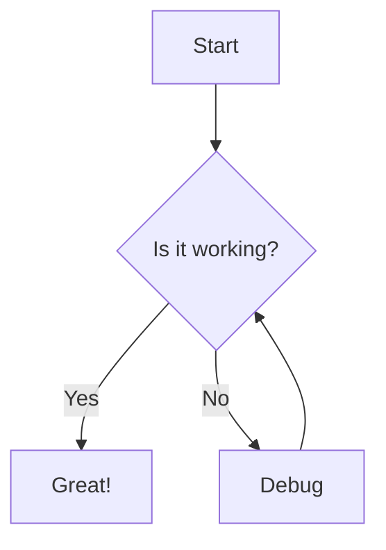

# Advanced Markdown Features

This post explores some of the more advanced features available in our Markdown-powered blog.

## Syntax Highlighting

One of the most useful features for technical blogs is syntax highlighting. Here are examples in different languages:

### Rust

```rust
fn fibonacci(n: u32) -> u32 {
    match n {
        0 => 0,
        1 => 1,
        _ => fibonacci(n - 1) + fibonacci(n - 2),
    }
}

fn main() {
    println!("Fibonacci(10) = {}", fibonacci(10));
}
```

### TypeScript

```typescript
interface User {
  id: number;
  name: string;
  email: string;
}

function fetchUser(id: number): Promise<User> {
  return fetch(`/api/users/${id}`)
    .then(response => {
      if (!response.ok) {
        throw new Error('Network response was not ok');
      }
      return response.json();
    });
}
```

### CSS

```css
.container {
  display: grid;
  grid-template-columns: repeat(auto-fill, minmax(250px, 1fr));
  gap: 1rem;
  padding: 1rem;
  max-width: 1200px;
  margin: 0 auto;
}

.card {
  border-radius: 8px;
  overflow: hidden;
  box-shadow: 0 4px 6px rgba(0, 0, 0, 0.1);
  transition: transform 0.2s ease;
}

.card:hover {
  transform: translateY(-5px);
}
```

## Complex LaTeX Expressions

LaTeX is perfect for displaying complex mathematical formulas:

The Gaussian integral:

$$
\int_{-\infty}^{\infty} e^{-x^2} \, dx = \sqrt{\pi}
$$

Navier-Stokes equations in vector form:

$$
\rho \left( \frac{\partial \mathbf{v}}{\partial t} + \mathbf{v} \cdot \nabla \mathbf{v} \right) = -\nabla p + \nabla \cdot\mathbb{T} + \mathbf{f}
$$

The Schrödinger equation:

$$
i\hbar\frac{\partial}{\partial t}\Psi(\mathbf{r},t) = \hat H\Psi(\mathbf{r},t)
$$

## Footnotes and Citations

You can use footnotes in your Markdown[^1] which is great for adding additional context without breaking the flow of your text.

[^1]: This is a footnote that appears at the bottom of the page.

## Diagrams (via Mermaid)

Many Markdown processors support diagrams through Mermaid syntax:



## Task Lists

- [x] Write the first blog post
- [x] Add syntax highlighting
- [ ] Set up comments section
- [ ] Add dark mode toggle

These advanced features make Markdown an incredibly powerful tool for technical writing and documentation.
